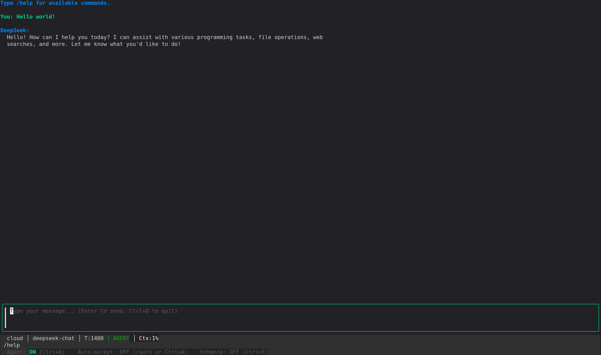

# Deep-CLI

A terminal AI assistant powered by [DeepSeek](https://deepseek.com), written in Go. Requires a DeepSeek API key. Features a rich interactive TUI, agent mode with tool calling, web search capabilities, and file editing with confirmation controls.



## Features

- **Interactive TUI** with streaming responses and markdown rendering
- **Agent mode** — the model can read, write, and search files, run shell commands, and search the web; multiple tool calls execute in parallel automatically, and complex tasks can be delegated to parallel subagents
- **Slash commands** for managing context, models, and settings
- **Prompt enhancement** — automatically rewrites your prompt before sending
- **Context compression** — summarize long conversations to free up token space
- **Auto-accept mode** — approve all agent edits and commands automatically, or review each one individually
- **Project init** — generate a `CONTEXT.md` file documenting your project with `/init`
- **Conversation export** — save any session to a markdown file with `/save`
- **Multiline input** — `Shift+Enter` inserts a newline; `Enter` submits
- **Prompt history** — up/down navigation, persisted across sessions (`~/.local/share/deep-cli/history`)
- **Autocomplete** for commands, file paths, and search engines

---

## Installation

### Prerequisites

- Go 1.22 or later
- A [DeepSeek API key](https://platform.deepseek.com)

### Build from source

```bash
git clone https://github.com/victorjdg/deep-cli
cd deep-cli
make build
```

This produces a `deepseek` binary in the current directory.

### Install to PATH

```bash
make install
```

Copies the binary to `$GOPATH/bin` or `/usr/local/bin`.

### Linux builds (amd64 and arm64)

```bash
make build-all   # Produces binaries for Linux amd64 and arm64 in dist/
```

---

## Configuration

Copy `.env.example` to `.env` and fill in your values:

```bash
cp .env.example .env
```

| Environment Variable     | Description                                       | Default                        |
|--------------------------|---------------------------------------------------|--------------------------------|
| `DEEPSEEK_API_KEY`       | DeepSeek API key (required)                       | —                              |
| `DEEPSEEK_MODEL`         | Model to use                                      | `deepseek-chat`                |
| `DEEPSEEK_MAX_CONTEXT`   | Max context window size in tokens                 | Auto-detected from model       |
| `TAVILY_API_KEY`         | API key for Tavily web search                     | —                              |
| `BRAVE_SEARCH_API_KEY`   | API key for Brave Search                          | —                              |
| `SEARXNG_HOST`           | Base URL for SearXNG instance                     | —                              |
| `DEEPSEEK_MAX_SUBAGENTS` | Max parallel subagents for `delegate_task`        | `5`                            |

Configuration priority (highest to lowest): **CLI flags → environment variables → defaults**

---

## Usage

### Interactive mode (REPL)

```bash
deepseek [flags]
```

Flags:

| Flag              | Short | Description                          |
|-------------------|-------|--------------------------------------|
| `--api-key`       | `-k`  | DeepSeek API key                     |
| `--model`         | `-m`  | Model name to use                    |
| `--max-context`   |       | Context window size in tokens        |
| `--max-subagents` |       | Max parallel subagents (default: 5)  |

### Single-prompt mode

```bash
deepseek chat "Explain what a B-tree is"
```

---

## Slash Commands

Type any command starting with `/` in the interactive REPL:

| Command               | Description                                                  |
|-----------------------|--------------------------------------------------------------|
| `/help`               | Show all available commands and keyboard shortcuts           |
| `/file <path> ...`    | Load one or more files into the conversation context         |
| `/clear`              | Clear conversation history                                   |
| `/compact`            | Summarize and compress the conversation (AI-assisted)        |
| `/enhance`            | Toggle prompt enhancement mode                               |
| `/agent`              | Toggle agent mode (tool calling)                             |
| `/auto`               | Toggle auto-accept mode for file edits and commands          |
| `/init`               | Analyze the current project and generate a `CONTEXT.md` file |
| `/undo`               | Revert the last file edit made by the agent (stackable)      |
| `/save [path]`        | Export the conversation to a markdown file                   |
| `/search [engine]`    | Show or change the active web search engine                  |
| `/models`             | List all available models from the API                       |
| `/model [name]`       | Show current model or switch to a new one                    |
| `/cost`               | Show token usage and context window percentage               |
| `/exit`               | Exit the application                                         |

### Inline file loading

You can embed file references directly in your messages:

```
Explain this /file main.go
Review these /file src/api.go /file src/types.go and suggest improvements
```

---

## Keyboard Shortcuts

| Shortcut      | Action                                      |
|---------------|---------------------------------------------|
| `Enter`       | Submit message                              |
| `Shift+Enter` | Insert newline (multiline input)            |
| `Ctrl+E`      | Toggle prompt enhancement                   |
| `Ctrl+A`      | Toggle auto-accept mode                     |
| `Ctrl+T`      | Toggle agent trace panel                    |
| `Ctrl+L`      | Clear the screen                            |
| `Ctrl+C`      | Cancel ongoing stream / Quit                |
| `Ctrl+D`      | Quit                                        |
| `Tab`         | Autocomplete command, file path, or engine  |
| `↑ / ↓`      | Navigate prompt history                     |
| `Escape`      | Close autocomplete or model picker          |

---

## Agent Mode

The model can autonomously use tools to answer questions, explore your codebase, edit files, and run commands. Agent mode is **enabled by default** and can be toggled with `/agent`.

### Available tools

| Tool                  | Description                                                            |
|-----------------------|------------------------------------------------------------------------|
| `list_files`          | List files and directories at a given path (max 200 entries)           |
| `read_file`           | Read the contents of a text file (max 512 KB)                          |
| `read_multiple_files` | Read several files in a single call                                    |
| `write_file`          | Write text content to a file, creating it or overwriting it (max 4 MB) |
| `patch_file`          | Apply a surgical edit by replacing an exact string in a file           |
| `search_files`        | Search for a regex pattern across files, returning file:line matches   |
| `glob`                | Find files matching a glob pattern (e.g. `**/*.go`)                    |
| `get_file_info`       | Get metadata for a file: size, modification time, permissions, MIME    |
| `web_search`          | Search the web using the configured search engine (max 5 results)      |
| `fetch_url`           | Fetch the full text content of a web page (max 8 000 chars)            |
| `run_command`         | Run a shell command and return its output (requires confirmation)      |
| `delegate_task`       | Delegate a self-contained task to a subagent with its own tool loop    |

The agent runs in a loop of up to 10 iterations: each iteration calls the LLM, executes any requested tools, feeds results back, and repeats until the model produces a final response with no tool calls.

**Tool calls within a single iteration execute in parallel.** Read-only tools (`list_files`, `read_file`, `glob`, `web_search`, etc.) always run concurrently. Destructive tools (`write_file`, `patch_file`, `run_command`) also run in parallel when auto-accept is ON; otherwise they run sequentially after the parallel read phase, one confirmation at a time. Results are always fed back to the model in the original order.

> **Security:** File tools are sandboxed to the current working directory. Path traversal attempts are blocked. `run_command` always asks for confirmation unless auto-accept mode is active.

### Agent trace

Press `Ctrl+T` at any time to open the trace panel, which shows every tool call made during the current session along with its result. Errors appear in red. The panel supports scrolling and accumulates entries even when closed.

### Auto-accept mode

By default, any tool that modifies the filesystem (`write_file`, `patch_file`) or runs a command (`run_command`) will pause and ask for confirmation before executing. Toggle this behaviour with `/auto` or `Ctrl+A`:

- **Auto-accept OFF** (default) — a confirmation prompt appears for every edit or command, showing the file path or command before you approve
- **Auto-accept ON** — all actions execute immediately without prompting

The current state is always visible in the status bar (`│ AUTO` indicator).

---

## Project Init (`/init`)

The `/init` command analyzes your current project and generates a `CONTEXT.md` file documenting its architecture, tech stack, key directories, and build commands.

```
/init
```

It works by:
1. Building a directory tree of the project (up to 4 levels deep)
2. Reading key files from the root (`README.md`, `go.mod`, `package.json`, `Makefile`, `Dockerfile`, etc.)
3. Sending everything to the model in a single request
4. Writing the result to `CONTEXT.md` and displaying a summary in the terminal

The generated file can be loaded into context with `/file CONTEXT.md` at the start of future sessions to give the model immediate project awareness.

---

## Web Search

The `web_search` tool uses the engine configured via `/search`. Three engines are supported:

| Engine    | Env var required          | Type        |
|-----------|---------------------------|-------------|
| `tavily`  | `TAVILY_API_KEY`          | Cloud API   |
| `brave`   | `BRAVE_SEARCH_API_KEY`    | Cloud API   |
| `searxng` | `SEARXNG_HOST`            | Self-hosted |

Switch engines at runtime:

```
/search brave
/search searxng
```

The engine selection is **not persisted** between sessions; configure your preferred engine via the default in the source or by running `/search <engine>` after starting the app.

---

## Supported Models

| Model               | Context     | Use case                                |
|---------------------|-------------|-----------------------------------------|
| `deepseek-chat`     | 128K tokens | General purpose, coding, analysis       |
| `deepseek-reasoner` | 128K tokens | Complex reasoning and problem solving   |

Use `/models` to list all models available in your account, or `/model <name>` to switch.

---

## Project Structure

```
├── main.go                   # Entry point
├── Makefile                  # Build targets
├── .env.example              # Environment variable template
├── cmd/
│   ├── root.go               # Interactive REPL command
│   └── chat.go               # Single-prompt command
└── internal/
    ├── api/                  # DeepSeek API client
    ├── config/               # Configuration loading
    ├── markdown/             # Terminal markdown rendering
    ├── search/               # Web search engines (Tavily, Brave, SearXNG)
    ├── session/              # Conversation and token management
    ├── tools/                # Agent tool definitions and execution
    └── tui/                  # BubbleTea TUI components
```

See the [documentation](./documentation/) directory for detailed internals.

---

## Contributing

Contributions are welcome! Whether it's a bug report, a feature request, or a pull request — all input is appreciated.

- **Found a bug?** Open an issue describing what happened and how to reproduce it.
- **Have an idea?** Open an issue to discuss it before implementing, so we can make sure it fits the project direction.
- **Want to contribute code?** Fork the repo, make your changes, and open a pull request. Keep changes focused and include a clear description of what you did and why.

There are no strict rules — just be respectful and constructive. Every contribution, big or small, is valued.

---

## Acknowledgements

This project was inspired by [deepseek-cli](https://github.com/holasoymalva/deepseek-cli) by [@holasoymalva](https://github.com/holasoymalva). Thanks for the original idea and the motivation to build on top of it.

---

## License

MIT
